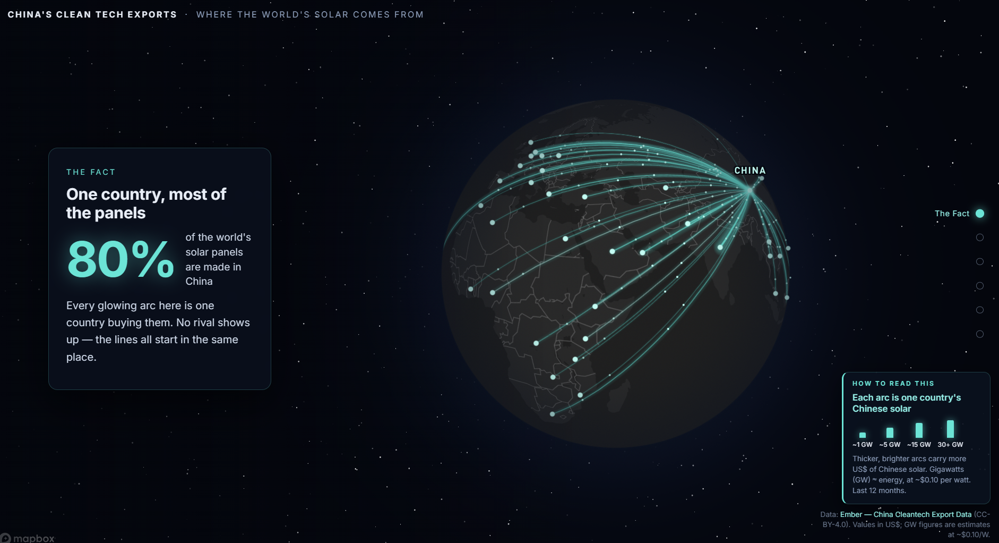

# China's Clean Tech Exports — a scrollytelling flow map

[](https://chris-tine-wei.github.io/china-clean-tech-exports/)
[](https://ember-energy.org/data/china-cleantech-export-data/)



An interactive globe of China's clean-tech exports — animated arcs, embedded charts, and a 16-month timeline you can scrub through. Built to tell a specific story: in March 2026, China's solar exports to Africa tripled in a single month. This is what that looks like.

**[→ Open the live map](https://chris-tine-wei.github.io/china-clean-tech-exports/)** · **[→ Watch the walkthrough](https://www.youtube.com/watch?v=tYnyAamblSo)**

---

## The story

The map walks through six chapters:

1. **The Fact** — 80% of the world's solar panels are made in China. Every arc on the globe starts in the same place.
2. **The Spike** — In March 2026, exports to Africa hit $685M — more than triple the month before.
3. **Why It Happened** — A Middle East war pushed fuel prices up. China's 9% solar export tax rebate was ending April 1. Nigeria, Kenya and Ethiopia each pulled in close to a gigawatt of panels in a single month.
4. **Gulf Goes Dark** — At the same moment, Middle East imports collapsed from $286M to $93M, tracking the Strait of Hormuz shutdown.
5. **The Bigger Picture** — Solar is the small story. China ships 2–4× more batteries and EVs by dollar value than solar panels every month.
6. **See It Move** — Press play and watch 16 months of exports animate. March 2026: Africa flares as the Gulf fades.

---

## Built with

- [Mapbox GL JS v3.7](https://docs.mapbox.com/mapbox-gl-js/) — globe, arcs, and camera animation
- [Scrollama v3.2](https://github.com/russellsamora/scrollama) — scroll-triggered narrative steps
- [Chart.js](https://www.chartjs.org/) — embedded data charts
- [Python / pandas](https://pandas.pydata.org/) — data reshaping from Ember's raw CSV

No framework, no build step. One HTML file, one JS file, one CSS file.

---

## Run it locally

```bash
# 1. Get a free Mapbox token at https://account.mapbox.com/access-tokens/
#    Open app.js and paste it as the MAPBOX_TOKEN value (starts with pk.)

# 2. Serve locally — fetch() requires http://, not file://
python -m http.server 8000

# 3. Open http://localhost:8000
```

The narrative and charts work without a token. Only the globe requires one.

---

## Regenerate the data

`data/flows.json` and `data/flows-monthly.json` ship ready to use. To rebuild from the full Ember dataset:

1. Download **"China Cleantech Data – by technology category (CSV)"** from [Ember](https://ember-energy.org/data/china-cleantech-export-data/) and save as `data/clean_tech_exports_full_release_monthly.csv`
2. Run:
```bash
pip install pandas
python scripts/2026-06-17-reshape-exports.py
```

---

## Data

All export figures come from [Ember's China Cleantech Export Data](https://ember-energy.org/data/china-cleantech-export-data/), released under CC-BY-4.0.

Values are in US dollars. Gigawatt figures are estimates at ~$0.10/W (2025 Chinese module export prices) — the map leads with dollar values, which are exact.

---

## About

Built by [Christine Peng](https://www.linkedin.com/in/christine-peng/) as a data storytelling project at the intersection of climate, trade, and visualization.

Questions or feedback? Open an issue or say hi on [LinkedIn](https://www.linkedin.com/in/christine-peng/).
